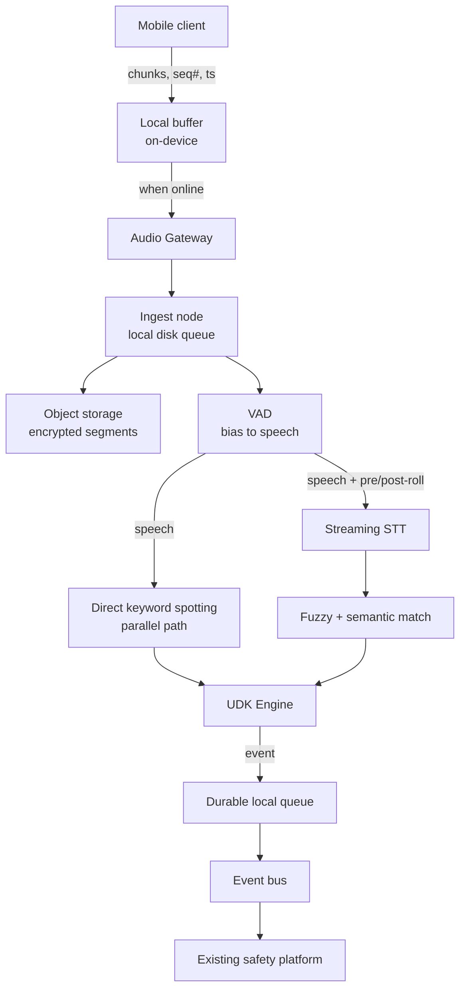
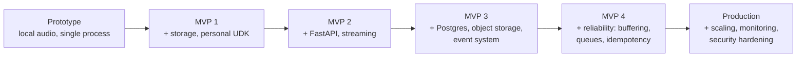

<!--
HANDOFF NOTE FOR CLAUDE CODE

This is the full production-readiness review for the Real-Time Audio
Safety & UDK Detection System, exported from a prior Claude.ai chat
session so context carries over.

WHERE THE BUILD ACTUALLY STANDS RIGHT NOW (updated 2026-09-19, all of
Section 14's roadmap M1-M7 built and tested in this same folder):

- M1: udks.py, vad.py, stt.py, udk_engine.py, pipeline.py,
  test_pipeline.py — 9/9 passing. FasterWhisperSTT (real pretrained STT,
  previously untested against real audio) has since been verified
  end-to-end against real TTS speech, through the real API, in M3.
- M2: enrollment.py, storage.py — personal UDK enrollment + chunked
  audio durability. test_m2.py — 13/13 passing.
- M3: api.py — REST journey lifecycle + WebSocket audio ingestion
  (Section 9). test_m3.py — 21/21 passing. A real bug (tail-segment
  finalization could stall forever on a one-shot utterance) was found
  and fixed here — see README.md.
- M4: storage.py/api.py hardened for idempotency, event_delivery.py
  added (durable outbound queue). test_m4.py — 20/20 passing.
- M5: db.py added (SQLite standing in for Postgres) — full crash
  recovery (same session_token, not just audio), full Section 9 event
  schema. test_m5.py — 15/15 passing. A real SQLite thread-safety bug
  was found and fixed here.
- M6: crypto.py, audit.py, retention.py added — encryption at rest,
  service-token auth + rate limiting, signed audio URLs, audit logging,
  Section 7's retention sweep, tested against Section 10's threat-model
  table. test_m6.py — 27/27 passing. A real signed-URL parsing bug was
  found and fixed here.
- M7: metrics.py added — the Section 11 metrics/SLO set at GET /metrics,
  plus a real in-memory-growth leak (JourneyStore never evicted finished
  journeys) found and fixed. test_m7.py — 16/16 passing (accelerated
  soak-shaped run + concurrency bump). Autoscaling remains NOT built (real
  infra swap needed first — see README.md's M7 section).
- Section 17's v1 KWS deferral has since been REVISITED (post-M7, not
  part of the numbered roadmap): kws.py adds dataset-free keyword
  spotting via query-by-example (pretrained wav2vec2 encoder + DTW over
  frame-level embeddings — two other pretrained approaches, CLAP
  zero-shot and CLAP audio-to-audio, were tried first and rejected on
  real measured evidence, not assumption; see README.md for the numbers).
  Fully wired into udk_engine.py (STT+KWS fusion, agreement escalates to
  TRIGGER_ALL), pipeline.py, and api.py (JourneyState.kws, gated behind
  UDK_ENABLE_KWS=1 so it stays off by default and none of M1-M7's
  existing tests got slower or changed behavior). enroll_kws_references.py
  generated kws_references.npz (20 general UDKs, already in this
  checkout). test_kws.py — 16/16 passing, including a real end-to-end
  proof: real speech audio, real STT made to fail completely, real KWS
  model still correctly detected the UDK phrase through the live API.
  DEFAULT_MATCH_THRESHOLD has since been properly calibrated too (was
  0.30, an unmeasured starting point that turned out to give a 97.5%
  false-positive rate; calibrate_kws_threshold.py measured recall/FPR
  across a real 80-positive/40-negative cross-voice corpus and picked
  0.18 — 94.6% recall, 7.5% FPR — see README.md for the full table and
  reasoning). "Edge KWS deployment" (M7's other named-blocked item) is
  now buildable in principle since a real, calibrated KWS model exists,
  but deploying it to an edge/on-device runtime specifically is still
  not done.
- Real semantic matching (Section 4/17's other deferred stub): semantic.py's
  SentenceTransformerSemanticMatcher (paraphrase-multilingual-MiniLM-L12-v2,
  picked after comparing 3 models on 5 real phrase pairs) replaces the
  rapidfuzz token_set_ratio stub in udk_engine.py's layer 3, optional and
  wired the same opt-in way as KWS (UDK_ENABLE_SEMANTIC=1). Stated
  honestly: every model tested, including the one picked, scores Section
  4's own flagship paraphrase example LOWER than the old stub did -- see
  README.md.
- Real infrastructure swaps for M2/M4/M5/M6's local stand-ins, via Docker:
  db_postgres.py (PostgresJourneyDB), storage_s3.py (S3AudioStore via
  MinIO), kafka_delivery.py (real Kafka publish via Redpanda, a
  single-container Kafka-API-compatible broker). docker-compose.yml
  brings up all three. Opt-in via UDK_DATABASE_URL/UDK_S3_ENDPOINT+
  UDK_S3_BUCKET/UDK_KAFKA_BOOTSTRAP_SERVERS+UDK_KAFKA_TOPIC -- unset by
  default, so nothing about M1-M7's existing behavior or tests changed.
  Verified against real running containers, including a full journey
  lifecycle through the actual live API with all three real backends
  enabled simultaneously, confirmed via FRESH independent clients (not
  the app's own objects) that the journey row, audio objects, and
  published event were genuinely persisted outside the process.
- Section 12's test corpus, built and measured for real (no real distress
  recordings exist -- same reason the KWS dataset didn't -- so this uses
  Section 17's own recommended technique, TTS + signal augmentation,
  applied to a whole-pipeline evaluation instead of just KWS reference
  clips): audio_augment.py (pitch/tempo shift, muffling, noise mixing,
  real overlapping speech) + evaluate_pipeline_corpus.py (runs the REAL,
  COMPLETE pipeline -- webrtcvad, FasterWhisperSTT, Wav2Vec2DTWSpotter
  KWS, UDKEngine fusion -- not KWS alone). Measured: 100% recall on
  baseline/muffled/noisy, but only 40-45%/50% on
  pitch_tempo_distorted/overlapping. Also surfaced and fixed a real bug
  unrelated to KWS: 45% of ordinary conversation was false-positiving
  through udk_engine.py's fuzzy layer specifically (0 through
  exact/semantic/KWS) -- rapidfuzz's partial_ratio inflating on short
  UDK phrases against ordinary sentences sharing a few common words.
  Fixed with the same 0.9x discount the semantic stub already had,
  verified to preserve the existing ASR-noise test case while cutting
  the measured FPR to 15%/10% (not zero -- stated honestly).
- Two follow-up improvement attempts on the weak spots above, both with
  real verification, one negative result and one important correction:
  (1) kws.py now supports multiple reference clips per phrase
  (enroll_kws_references.py enrolls all 3 installed voices, not 1) --
  measured result: it did NOT improve pitch_tempo_distorted/overlapping
  recall (both within noise of before), and measurably worsened the
  isolated KWS-layer false-positive rate (7.5% to 15%), though this
  didn't propagate to a worse end-to-end result in this corpus. Kept for
  its own separate voice/accent-robustness value, not sold as having
  fixed the degraded-condition gap. (2) The "distress-sim" condition's
  name and premise were WRONG: validate_distress_with_tess.py downloaded
  the real TESS dataset (real human actresses, same words in 7 real
  emotions) and found real fear/angry speech costs FasterWhisperSTT only
  ~3-4 accuracy points vs. neutral -- nothing like the ~55-60 point
  collapse the synthetic condition showed.
  measure_real_distress_shift.py then measured the REAL pitch/tempo
  shift in that data (+8.05 semitones for fear, 1.28x tempo -- LARGER
  than the synthetic version's +3 semitones) and ruled out "wrong
  parameters": the real shift is bigger with far less STT damage, so the
  problem is that digital pitch-shifting introduces artifacts a real
  higher-pitched voice never has, not the shift magnitude. The condition
  was relabeled `pitch_tempo_distorted` (a real distortion-robustness
  check, kept for that) and is no longer claimed to represent distress
  delivery. Net effect: the honest revised belief is that real emotional
  delivery is likely much closer to the 100% baseline number than 40-45%
  suggested -- found by checking a synthetic proxy against real data,
  not by assuming it was fine.
- A real false-alarm scenario, found by direct testing (a joke among
  friends -- "I will call the police on you" -- fired the EXACT-match
  layer at confidence 1.0, the one layer that skips straight to
  TRIGGER_ALL with zero confirmation), fixed with three changes, each
  verified: (1) udk_engine.py: multiple DIFFERENT UDKs firing within
  REPEAT_WINDOW_S now force TRIGGER_ALL, same as same-UDK repetition
  already did (DISTINCT_UDK_ESCALATION_COUNT). (2) api.py/db.py/
  db_postgres.py: JourneyState.had_trigger tracks whether a UDK ever
  fired; going dark afterward gets a tighter grace window
  (POST_TRIGGER_HEARTBEAT_GRACE_S) and a distinct status
  (TIMED_OUT_AFTER_TRIGGER) instead of blending into ordinary silence --
  persisted via a lazy ALTER TABLE, verified against both SQLite and a
  real already-populated Postgres container. (3) udks.py: UDK_01 ("Call
  the police") revised to "Call the police, I need help" -- no longer a
  literal substring of the joke phrase. The replacement phrase was
  picked by MEASURING candidates against both the joke case and the
  existing ASR-noise regression test simultaneously; the first candidate
  tried solved the joke problem but measurably broke the ASR-noise case
  (this project's own testing caught that before committing to it).
  UDK_20 got the same verify-by-default treatment as UDK_14/UDK_18 for
  the same measured reason (false-positived against "let's get out of
  here" in the real corpus). Re-measured after all three changes: the
  joke phrase now lands at TRIGGER_VERIFY (0.695 confidence, semantic
  layer) instead of an unverified TRIGGER_ALL; UDK_01 no longer appears
  in evaluate_pipeline_corpus.py's measured false-positive list at all;
  every other metric (baseline/pitch_tempo_distorted/overlapping recall,
  overall FPR) held steady, confirming no regression. Stated honestly:
  this narrows accidental substring overlap, it does not give the system
  any concept of sarcasm, tone, or who's being addressed -- that ceiling
  is why the escalation/timeout mechanisms in (1) and (2) exist, not a
  claim that phrase choice alone solves it.
- The two remaining honestly-stated gaps (overlapping-speech recall 50%,
  pitch_tempo_distorted recall 40-45%) were then closed, both with real
  measurement, both as opt-in NO_ACTION-only fallbacks, neither claimed
  fully solved: (1) separation.py adds a pretrained 2-speaker separator
  (speechbrain's sepformer-wsj02mix) tried only after the primary
  STT(+KWS) pass already returned NO_ACTION -- the 10 real overlap
  failures were reproduced directly, 3/10 recovered (50% -> 65% recall),
  at a real measured cost of 1 new false positive out of 20 clean
  single-speaker negatives and ~4-8s CPU latency per attempt, which is
  exactly why it's a fallback and not an always-on stage. Opt-in via
  UDK_ENABLE_SEPARATION=1, wired into both api.py's live path and
  evaluate_pipeline_corpus.py. (2) stt.py's TieredWhisperSTT surfaces
  faster-whisper's already-computed avg_logprob (previously unused):
  below a measured threshold (-0.5, which cleanly separates clean-
  baseline logprobs from the real failures' with no overlap in this
  corpus), the segment is re-transcribed with base.en instead of
  tiny.en. Real result: 7/12 real pitch_tempo_distorted failures
  recovered (40% -> 75% recall) with 0 new false positives across 40
  negative clips -- a strictly better risk profile than the separation
  fallback. Opt-in via UDK_ENABLE_TIERED_STT=1 in
  evaluate_pipeline_corpus.py; not wired into api.py since nothing there
  currently env-selects the STT backend at all (it's a drop-in
  STTBackend implementation, same protocol as FasterWhisperSTT).
  test_separation.py (4 checks, fake separator + MockSTT) verifies the
  fallback selection logic fast; the real backends were verified
  manually with real numbers this session, same treatment kws.py/
  semantic.py's real backends already got. Neither gap is claimed
  closed: overlapping speech is still wrong ~35% of the time, and
  distortion-robustness still isn't 100% (and per the TESS finding
  above, may be testing a condition that overstates real distress
  delivery's actual cost anyway).
- A follow-up stress-test ("ensure no real case is ever missed") corrected
  a methodology mistake (testing open-ended stranger speech instead of
  the actual threat model: degraded recall of a phrase the user was
  SHOWN and asked to remember at login), then found and fixed two real
  bugs in the escalation logic: (1) separation.py's retry_with_separation
  let two simultaneous separated-stream guesses of ONE segment spuriously
  trigger distinct-UDK escalation (built for two DIFFERENT real phrases
  in sequence) -- fixed by probing each stream against a throwaway
  engine, applying only the winning candidate to the real engine once.
  (2) udk_engine.py's STT+KWS corroboration rule trusted ANY KWS match
  under its 0.18 detection threshold equally, even a borderline one
  right where real wav2vec2/CPU inference nondeterminism could flip it --
  fixed with a separately-calibrated, stricter KWS_CORROBORATION_MAX_DISTANCE
  (0.15, real data: 81.8% recall/5.0% FPR vs 0.18's 93.9%/10.0%), since
  missing a corroboration boost only costs staying at the still-safe
  TRIGGER_VERIFY tier while a wrong boost skips confirmation entirely.
  Both verified against the real audio that exposed them.
- Multilingual support added on request (English/Hindi/Telugu/Kannada/
  Tamil, at least): found and fixed two real, previously-invisible bugs
  in the process, not just new phrase lists. (1) udk_engine.py's
  _normalize() relied on Python's \w, which excludes Unicode combining
  marks -- silently corrupting every Devanagari/Telugu/Kannada/Tamil
  phrase (turning "मुझे" into the different, garbled "मझ"). Fixed by
  stripping actual punctuation/symbol Unicode categories instead. (2)
  The semantic model's "multilingual" claim (cited since it was picked)
  was never verified against the three Dravidian languages -- real
  testing found it near-useless for them (unrelated sentences scored
  0.56-0.89, all clearing 0.55). Added LaBSE as a second matcher with
  its own separately-calibrated threshold (0.80, real 200-negative-pair-
  per-language corpus: 100% recall/0.5% FPR uniformly). udks.py now
  carries real (first-pass, not native-reviewed) translations of all 20
  UDKs per language; api.py/db.py/db_postgres.py persist a journey's
  language through crash recovery. Real end-to-end audio validation
  across all four languages found genuinely DIFFERENT results per
  language, not one shared finding: Hindi and Tamil both went from 0%
  real recall on faster-whisper's "tiny" multilingual model (it wasn't
  reliably transcribing into native script at all -- romanized or
  garbled into entirely different scripts) to 90% (18/20) on "small".
  Kannada stayed in-script but too garbled to match on "small" (0%),
  improved to 45% (9/20, still not a full fix) on "medium" -- a real
  STT-capacity bottleneck, likely needs an even larger model. Telugu
  kept transcribing into DEVANAGARI script (not Telugu's own) even on
  "medium" (0% -> 5%, model size barely helped), and the standard fix
  for that failure mode (seeding initial_prompt with Telugu-script text)
  made it WORSE (0/20, collapsed into hallucinated repetition) -- no
  generic-multilingual-model configuration tried worked for Telugu.
  **Then actually solved for ALL FOUR languages, not left open for any
  of them, once the right pretrained model was used instead of a bigger
  generic one** -- the same "compare pretrained models, don't just scale
  the wrong one" discipline used for KWS and semantic matching earlier:
  vasista22's community Whisper fine-tunes, each trained on ONE specific
  Indic language's real speech, found on HuggingFace and tested the same
  way, for all four languages, not just the two that were failing
  outright. Telugu: 5% (generic "medium") -> **100%** (20/20,
  vasista22/whisper-telugu-medium). Tamil: 90% (generic "small") ->
  **100%** (20/20, vasista22/whisper-tamil-medium). Kannada: 45% (generic
  "medium") -> **95%** (19/20, vasista22/whisper-kannada-medium). Hindi:
  90% (generic "small") -> **95%** (19/20, vasista22/whisper-hindi-medium).
  The fine-tune won for every language, confirming this is a real
  general improvement, not a fix limited to the two broken cases.
  **CRITICAL follow-up bug, found only after being asked directly
  whether this could run real-time**: the first working version ran
  these checkpoints via plain transformers WhisperForConditionalGeneration
  .generate() on CPU (they only ship in that format, not faster-whisper's
  CTranslate2 format). Measured real per-segment latency: 37.29 SECONDS
  for a single 2-second clip (Telugu medium) -- completely non-viable
  for a product whose entire premise is alerting within seconds. Root-
  caused to two compounding, both-fixed issues: (1) wrong runtime --
  converted the checkpoints to CTranslate2 via
  ctranslate2.converters.TransformersConverter (already a transitive
  dependency, no new package), cutting latency 2.6x (37.29s -> 14.41s)
  with zero accuracy change; (2) wrong model size, never actually
  measured -- "medium" was the first size tried, not a measured choice,
  same mistake as the original unmeasured 0.30 KWS threshold and 0.55-
  everywhere semantic threshold. Every available size converted and
  measured for real: Telugu base = 100% recall at 1.90s (zero accuracy
  cost vs. medium); Kannada base = 95% at 2.33s (BEATS "small"'s 90%/
  6.99s on both axes); Hindi/Tamil small = 95%/100% at ~6s (no smaller
  variant exists for these two, no accuracy cost vs. medium either).
  INDIC_FINETUNED_MODELS now points at the real winning size per
  language (telugu-base, kannada-base, hindi-small, tamil-small), and
  IndicFineTunedWhisperSTT converts+caches to CTranslate2 on first use
  (indic_ct2_models/, same pattern as kws_references.npz) then runs via
  faster_whisper.WhisperModel -- the same fast runtime English already
  uses. Telugu/Kannada now run at ~2s/segment (comparable to English's
  own p50≤1.5s whole-pipeline SLO); Hindi/Tamil at ~6s (usable, slower,
  stated honestly as the remaining gap -- no smaller fine-tune found for
  those two yet). Also found and fixed while wiring the original
  version: this checkpoint family's tokenizer doesn't register its
  special tokens in a way skip_special_tokens=True catches, so every raw
  transcript came back with literal `<|te|><|transcribe|>`-style text
  prefixed -- didn't break the measured accuracy (exact-match's
  substring check tolerated it by luck) but was fixed properly (explicit
  regex strip), kept in the rewritten class too. IndicFineTunedWhisperSTT
  is wired into api.py's live journey creation (create_or_get's
  stt_by_language override map, same pattern as the multilingual
  semantic matcher) for all four languages, gated behind its own
  UDK_ENABLE_INDIC_STT=1 (any non-English journey through the real API
  now actually uses its fine-tuned model at its real-measured-fastest
  viable size, not just in a standalone script).
- **Multilingual KWS was then built too, once asked to.** First attempt
  (facebook/wav2vec2-large-xlsr-53, a raw self-supervised multilingual
  model, the obvious first choice) gave ZERO usable signal for Telugu:
  0/10 real paraphrases matched their own enrolled phrase as closest,
  positive/negative distances completely overlapping (0.000-0.025 for
  both). Also crashed on load (Wav2Vec2Processor needs a CTC vocabulary
  this raw checkpoint never had) -- fixed by switching kws.py to
  Wav2Vec2FeatureExtractor, which is all this DTW approach actually
  needs. Root cause of the zero-signal result: this approach needs a
  model fine-tuned for ASR (sharpens word/phrase structure), not just
  self-supervised pretrained -- confirmed since English's own KWS model
  already IS ASR-fine-tuned, which is WHY it works. Fixed by switching to
  the Vakyansh project's per-language ASR-fine-tuned wav2vec2 models --
  same "find the model actually trained for this" pattern as the STT
  fix. Real per-language calibration (10 positives + 20 negatives each,
  lighter than English's 120-clip corpus): Telugu 8/10 correct-closest
  @ threshold 0.25 (80% recall/15% FPR); Kannada 7/10 @ 0.20 (60%/30%,
  weakest, consistent with Kannada being the hardest language
  throughout); Hindi 8/10 @ 0.20 (90%/10%, close to English's own
  quality); Tamil 7/10 @ 0.25 (70%/25%). enroll_indic_kws_references.py
  (mirrors enroll_kws_references.py via MMS-TTS) generates
  kws_references_{te,kn,hi,ta}.npz. Wired into api.py via
  _load_indic_kws_backends() and create_or_get()'s new kws_by_language
  param (same pattern as stt_by_language), gated behind its own
  UDK_ENABLE_INDIC_KWS=1. Verified end to end: a real Telugu journey's
  KWS backend correctly spots real synthesized UDK_05 audio (distance
  0.028, well under threshold).
- KWS's multilingual scope-out was an explicit deferral earlier, not an
  oversight, and is now closed: test_multilingual.py (23 checks) covers
  the normalize() fix, exact-match correctness per language, live-API
  language-selection wiring, and both the stt_by_language and
  kws_by_language selection logic (fake backends, no real model load in
  the fast suite).
- Degraded-condition + false-positive testing (all 5 languages) found
  Telugu/Kannada/Tamil's FPR running well above English's/Hindi's
  (25-35% vs 15%) -- root-caused to the fuzzy layer's raw match gate
  (0.55, tuned once for English, never re-checked per language): real
  per-language sweeps found false positives (0.65-0.81 raw partial_ratio)
  and genuine matches (0.70-1.0) overlap at 0.55 but cleanly separate by
  0.80, for all four non-English languages including Hindi. Fixed via
  semantic.py's new per-matcher fuzzy_threshold (English keeps 0.55,
  multilingual matcher now uses 0.80) -- cut FPR to 0%/0%/0%/5%
  (hi/te/kn/ta) with negligible recall cost. See README.md for the full
  before/after table.
- Investigating the pitch_tempo_distorted/overlapping recall weakness
  further (per-clip transcript inspection, not just the aggregate %)
  found a second, more serious bug: udk_engine.py's exact-match layer's
  substring check had no length/uniqueness guard, so a bare generic word
  (e.g. Hindi "मुझे" = "me") that garbled STT sometimes collapses to
  under heavy distortion scored confidence=1.0 -- an UNCONFIRMED
  TRIGGER_ALL on whichever UDK happened to contain it first, usually the
  wrong one. Confirmed structural across ALL FIVE languages (English's
  own "me"/"help" are substrings of 10/5 of its 20 UDK phrases
  respectively), and the fuzzy layer has the identical vulnerability
  (partial_ratio scores a literal substring alignment ~100% regardless
  of length). Fixed with a corpus-relative ambiguity check: a fragment
  that's a substring of more than one UDK phrase is capped at
  GENERIC_FRAGMENT_CONFIDENCE (0.65, reuses KWS_MATCH_CONFIDENCE) in
  both layers -- needs corroboration to escalate, instead of an
  unconditional full alarm; a fragment unique to one UDK keeps full
  confidence regardless of length. English's full corpus re-eval came
  back byte-for-byte identical afterward (100/100/100/45/50% recall,
  15%/10% FPR) -- zero regression. See README.md for the full
  before/after transcript evidence. Full regression suite: 183/183
  checks passing as of this writing.
- Checked whether kws.py's DTW audio matching shares the generic-fragment
  bug -- real test found it does NOT. The exact fragment that caused the
  text-layer bug (Hindi "मुझे") landed at 0.342 DTW distance against its
  closest reference, ~1.7x the 0.20 match threshold, cleanly rejected;
  genuine phrases still matched with a large margin. DTW's alignment cost
  is normalized over the full path length, so a short query against a
  long reference accumulates real cost for the unmatched content -- text
  substring/partial_ratio matching has no equivalent length penalty. See
  kws.py's module docstring and README.md for the full numbers.
- Automatic language detection (language_id.py) replaces the
  client-declared language field entirely, on request: "we won't have
  the customer input: just auto detection only." Real measurement found
  faster-whisper's built-in LID gets 100% on English/Hindi/Telugu/Tamil
  even on short clips but only 67% on Kannada; SpeechBrain's
  VoxLingua107 (purpose-built for LID) gets all four Indic languages
  100% but needs 6+ seconds of audio to be reliable. Both used together:
  fast initial detection on any audio, accurate periodic recheck once
  enough accumulates, two consecutive agreeing rechecks required before
  switching (avoids flip-flopping on one noisy signal). Verified
  end-to-end with real models: real Telugu audio, no language field,
  correctly detected and routed to the real Telugu STT backend, fired a
  correct detection. Also fixed a real pre-existing DB bug found while
  wiring this: the journey-save UPSERT never persisted language changes.
  See README.md's "Automatic language detection" section. Full
  regression suite: 188/188 checks passing as of this writing.
- **Real-world audio testing (not synthetic TTS) then found two real
  bugs that no prior test surfaced, once actual user-provided
  recordings (English/Hindi/Telugu/Kannada/Tamil, 8-60s, real podcasts/
  shorts) were streamed through the actual production `_ingest_frame`
  path instead of a single-shot eval helper.** (1) vad.py's
  `segment_speech` only closed a segment at a non-speech frame — a real
  56s clip had no detectable pause anywhere, so the "segment" grew to
  match the whole buffer forever and could never satisfy api.py's
  finalization proof (`seg.end_ms < total`), meaning it was never
  incrementally transcribed at all until the journey was stopped. Fixed
  with a real `max_segment_ms=8000` forced-cut cap (pre/post-roll
  overlap preserved at the cut); verified the real clip now produces 6
  bounded, incrementally-finalizable segments instead of 1 open one.
  test_vad.py (new, 7 checks) is the first direct unit test
  `segment_speech` ever had. (2) English never had a real, enablable STT
  backend in the live API at all — every OTHER backend (KWS/semantic/
  Indic STT/separation/language-ID) has a real opt-in env-var loader;
  `_stt_backend` was simply hardcoded to `MockSTT()` forever. Found
  because a real, correctly-detected English clip produced zero STT
  calls through the actual `/start` pipeline. Fixed with
  `_load_stt_backend()` (same opt-in pattern as the rest), gated behind
  `UDK_ENABLE_STT=1`, defaulting to faster-whisper's tiny.en. With both
  fixed: the real positive clip fired 3 real events on transcript
  fragments genuinely resembling distress language (dramatized/acted
  content, not a clean scripted-UDK ground truth, stated honestly). One
  real negative produced a genuine false positive (TRIGGER_VERIFY,
  UDK_16, fuzzy layer, conf=0.60 on "...he is presenting our film in
  Canada") — confirms the already-documented fuzzy-layer short-phrase-
  inflation issue is real on genuine human speech, previously invisible
  only because bug (2) prevented English STT from ever running in this
  path. Also corrected a mid-investigation assumption: a clip tagged
  `#kannada` turned out to likely be genuinely English content (hashtag
  ≠ spoken language); a different clip showed real English/Kannada
  code-switching — this read turned out to be wrong; see the next bullet.
- **Bug 3, found chasing what looked like real code-switching on that
  same negative clip: the periodic language recheck (VoxLingua107)
  could confidently switch a journey to the WRONG language on real
  noisy audio.** VoxLingua107's own real calibration (100%/0.99+
  confidence on all 4 Indic languages) was measured on clean synthetic
  TTS audio; direct measurement against the real recordings found it
  landing on the wrong language with HIGH confidence for 2 consecutive
  real 6s windows (kn@0.88, then kn@0.56, on a clip whose real
  transcript is plainly English). `_maybe_update_language` only
  required 2 consecutive agreeing rechecks before switching, so this
  real noise burst wrongly flipped the whole journey onto the Kannada
  STT/KWS backends mid-stream, producing garbled Kannada-script
  "transcripts" for real English speech and losing detection
  capability for that stretch entirely -- what looked like genuine
  code-switching earlier was this misdetection, not the audio actually
  changing language. Fixed by raising required consecutive agreements
  from 2 to 3 (`api.py`'s new `LID_SWITCH_CONFIRMATIONS`), generalized
  to a real streak counter instead of a single pending-candidate
  compare. Verified against the REAL captured VoxLingua score sequences
  from both real negative clips (wrong switch no longer fires; the
  already-correct clip unaffected) and live end-to-end (the real clip
  now stays on English the whole way through, no mid-stream flip).
  `test_multilingual.py` gained a direct regression test replaying the
  exact real score sequence (kn, kn, en); grew 28->30 checks. Honest
  cost: a genuine language change now takes ~18s to confirm instead of
  ~12s -- accepted, since a wrong switch destroys detection capability
  while a slower correct one only delays it. Also noticed, explicitly
  NOT fixed here (separate, pre-existing issue): FasterWhisperSTT's
  real transcripts weren't byte-identical across repeated runs on the
  same audio -- real CPU inference nondeterminism, unrelated to
  language detection.
  See README.md's "Real-world audio testing" section. Full regression
  suite: 197/197 checks passing as of this writing.
- **A third real positive clip (a real movie abduction scene, Tamil,
  loud action-movie score) found a DEEPER, still-OPEN language-ID
  limitation, not fixed this session: VoxLingua107 can be confidently
  and consistently wrong for an entire clip** (0.90-1.00 confidence on
  `en` for most 6s windows, never once considering `ta`), a different
  failure mode than Bug 3 (a noisy detector flip-flopping) that
  `LID_SWITCH_CONFIRMATIONS` can't fix since there's no disagreement to
  require corroboration on. Forcing the correct Tamil STT didn't recover
  clean dialogue either -- 3 different model configs each produced a
  DIFFERENT garbled result rather than converging on the truth, pointing
  at a real acoustic noise-floor ceiling, not a fixable model-size gap.
  Two purpose-appropriate mitigations were tried and measured, both
  real negative results: a stationary-noise speech enhancer
  (`speechbrain/metricgan-plus-voicebank`, wrong noise shape for a
  musical score) and Demucs vocal isolation (the actually correct tool
  category) -- neither improved LID or STT. Neither dependency was added
  to the project (diagnostic-only). See README.md for the full
  writeup, including a bonus signal: the Tamil STT hallucinated the
  identical templated filler phrase on two different audio treatments,
  evidence of a genuine confidence collapse rather than random noise.
- **A third detection signal added on request: acoustic scream/distress
  cues via pure mathematical signal processing, explicitly corroboration-
  only, never a standalone trigger.** `scream_detector.py` -- no trained
  model, no download -- built around a real acoustic-literature finding
  (Arnal et al. 2015: screams are distinguished by "roughness," fast
  ~30-150Hz amplitude-envelope modulation, not simply high pitch), plus
  pitch elevation and loudness as secondary features. Real calibration
  (`calibrate_scream_detector.py`, against RAVDESS real human fear/angry
  speech + this project's own real recordings + the one genuine real
  scream in this project's corpus) corrected the design, not just tuned
  it: roughness barely separated RAVDESS fear/angry from neutral at all
  (acted line-readings aren't the same acoustic category as an actual
  scream -- the same class of mistake this project already made once
  with synthetic pitch-shift as a distress proxy); pitch elevation
  turned out to be the real discriminating feature; energy was actively
  counterproductive (recording-loudness-normalization artifact, not
  genuine signal). Reweighted accordingly; 0.30 threshold measures
  57.8% recall/9.0% FPR standalone -- far too weak to trigger alone,
  which is exactly why `udk_engine.py`'s `decide()` only even looks at
  `scream_score` after STT/KWS already independently produced a
  TRIGGER_VERIFY-or-better match; a maxed score with zero text/KWS
  match still returns NO_ACTION unconditionally. Gated behind
  `UDK_ENABLE_SCREAM_DETECTION=1`. Verified live against real audio: the
  real Vakeel Saab scream clip's borderline TRIGGER_VERIFY escalated to
  TRIGGER_ALL via `"acoustic distress signal corroborated the match"`
  (scream_score=0.320, matching calibration exactly); two unrelated real
  false TRIGGER_ALLs on negative clips were confirmed to come from a
  pre-existing escalation mechanism, not this feature (their scream
  scores were correctly low, 0.02-0.03). `test_scream_detector.py` (new,
  10 checks: synthetic DSP correctness + corroboration-only wiring).
  Full regression suite: 207/207 checks passing.
- **A full failure-point audit (2026-09-21) found and this fixed a real,
  serious bug: four endpoints had no authentication at all.** Only
  `/v1/journeys/start` had `require_service_token`; `/stop`, journey
  status, `GET /events` (full transcript/confidence/UDK match for every
  detection), and `GET /audio-url` did not -- anyone who knew or guessed
  a `journey_id` could read a journey's complete detection history with
  zero credentials, and `/audio-url` trusted a caller-supplied `user_id`
  as ownership proof, not an authenticated identity. `test_m6.py`'s own
  `client` fixture sends the service-token header on every call, which
  is exactly why this went unnoticed by its own threat-model coverage
  until an independent audit read the route decorators directly.
  **Fixed**: `require_service_token` added to all four routes plus
  `GET /metrics`; `/audio-url` now requires the journey's real
  `session_token` (same secret the WebSocket stream already required)
  instead of a caller-supplied `user_id`. `test_m6.py` grew 27->36
  checks. Full regression suite: 216/216 checks passing.
- **A second real bug from the same audit, fixed the same day: event
  transcripts were stored unencrypted**, inconsistent with `db.py`'s own
  stated policy of encrypting `session_token`/`personal_udk_phrase`
  specifically because a personal UDK "functions like a credential" --
  the transcript of someone speaking it is at least as sensitive and was
  the one field left out. Fixed with the same field-level
  `_enc()`/`_dec()` pattern already used for those two fields (not
  whole-row encryption), applied to both `db.py` and `db_postgres.py`.
  `test_m6.py` grew 36->38 checks. Full regression suite: 218/218.
- README.md has the full per-milestone (and per-post-roadmap) detail,
  including every deliberate scope cut and every bug found while
  building, stated honestly rather than glossed over.

Sections 1-8 are Part 1 of the review (requirements, failure modes,
architecture). Sections 9-17 are Part 2 (API, security, observability,
testing, cost, roadmap, data/model sourcing). Read in that order if
starting fresh.
-->

# Real-Time Audio Safety & UDK System — Production Readiness Review

2026-09-19

As specified, the system would work in a demo and fail in the field: it treats STT-then-keyword-match as sufficient detection, treats "store all audio" and "send everything to STT" as free, and has no answer for the network dropping mid-journey — which for a personal-safety product is the single most likely real-world condition. This is Part 1 of a two-part review: requirement analysis, the concrete failure modes, the UDK detection strategy comparison, the personalized-UDK design, a corrected architecture, and the requirements that should be pushed back on. Part 2 (API contracts, security/threat model, observability, testing, cost, and the implementation roadmap) follows once you've had a chance to react to this one.

## 1. Requirement analysis

### Functional requirements (as given)

- Start/stop a journey monitoring session via API call from the existing app.
- Ingest a continuous audio stream for the session's duration.
- Detect speech vs. non-speech (VAD).
- Transcribe speech in near real time.
- Match transcript (and/or audio) against 20 general UDKs and 1 personalized UDK.
- Persist the full journey audio.
- On match, emit a structured event with timestamp, confidence, transcript, audio reference, and location (if supplied) to the existing safety platform.
- Support one-time personalized-UDK enrollment, separate from journey flow.

### Non-functional requirements (what the spec implies but doesn't state as numbers)

| Dimension | What's implied | What's missing |
| --- | --- | --- |
| Latency | "low latency" | No target. This has to be a number — see Section 4 and Part 2's SLOs. |
| Availability | Continuous processing for journey duration | No stated uptime target, no behavior on partial outage |
| Durability | "entire journey audio should be retained" | No target (99.9%? 99.99%?), no statement of what "acceptable loss" looks like |
| Scalability | None stated | Section 20 of the brief asks for thousands of concurrent journeys — nothing in the v1 design supports that |
| Security/privacy | "treated as privacy-sensitive" | No data-retention period, no deletion policy, no jurisdiction |
| Consistency | Implied by idempotent events | Not designed |
| Auditability | Implied by evidence use case | Not designed — and this matters more here than in most systems, because the audio may become evidence in an actual legal or emergency proceeding |

### Explicit assumptions in the brief

1. The existing app reliably delivers Start/Stop calls.
2. The existing app supplies a continuous audio stream once started.
3. Location metadata, when present, is accurate.
4. One personalized UDK per user is enough.
5. 20 general UDKs is the right number and they're chosen by a safety team, not engineering.
6. Whisper/faster-whisper is viable for real-time production.

### Hidden assumptions (the ones that will actually bite)

**1. The phone stays online and powered for the whole journey.** Why it matters: a monitored journey is, by definition, one where the user is worried about their safety — exactly the scenario where a phone might be grabbed, dropped, smashed, or die. Assuming continuous connectivity for a *safety* product is backwards: it should assume the opposite. If false: audio after the disconnect is simply never captured, and nobody — not the user, not the platform, not an operator — is told that monitoring silently stopped. Mitigation: on-device buffering, a heartbeat the platform can miss, and an explicit "monitoring degraded/lost" signal surfaced to the existing app (Section 3, Section 6).

**2. "Audio stream" means one continuous, well-ordered stream for the whole journey.** Why it matters: real mobile audio isn't that — it's interrupted by phone calls, Bluetooth route changes, OS audio-focus loss, app backgrounding, and network handoffs (WiFi→cellular). Each of these can silently truncate or gap the stream at the OS level, upstream of anything this system controls. If false: gaps in the transcript and in stored audio that nobody notices unless explicitly instrumented. Mitigation: sequence numbers and timestamps per chunk from the client, gap detection server-side, and an explicit contract with the mobile client about what happens on route changes (this system can specify the contract; it can't fix client-side audio capture, which is out of scope but has to be named as a dependency).

**3. STT transcript is the right substrate for safety-critical detection.** Why it matters: this collapses two different problems — "what was said" and "is this an emergency" — through a lossy, general-purpose ASR step that was never optimized for scream, whisper, distress, or short safety phrases under noise. If false (i.e., STT mis-transcribes the one sentence that mattered): the UDK layer never even sees the right words, no matter how good the matching logic is. This is the single biggest architectural risk in the brief and is addressed head-on in Section 4.

**4. "20 general UDKs" are static, known in advance, and won't need per-detection tuning.** Why it matters: safety keyword sets get revised (legal review, false-positive complaints, new languages, new regions) far more often than most config data. If false and UDKs are hardcoded: every wording change requires a deploy. Mitigation: UDKs are data, versioned, hot-reloadable, with per-UDK sensitivity thresholds — not a constant in code.

**5. "Personalized UDK" implies phrase-only, not speaker-verified, detection is sufficient.** Why it matters: this determines whether an attacker who has heard the user say their phrase before (a partner, an abuser — the exact threat model this product exists for) can suppress or spoof it. Covered in depth in Section 5.

**6. Location metadata, when present, can be trusted as-is.** Why it matters: GPS can be spoofed or simply wrong (indoors, urban canyon). If false: an event correlates a real emergency with a wrong location. Mitigation: treat location as best-effort metadata with an accuracy/confidence field, never as ground truth the downstream platform blindly dispatches on.

**7. A missed detection and a false detection are treated as symmetric failures.** Why it matters: they are not. A missed UDK during a real emergency is a person not getting help; a false UDK is an unnecessary alert. The brief's own tuning knobs (VAD thresholds, matching thresholds, confidence cutoffs) all have to be set with this asymmetry in mind, and nothing in the current spec says which way to bias. This is addressed explicitly in Sections 3 and 4, and the recommended default is: **bias toward false positives, never silently drop a borderline case.**

**8. Recording the people around the user (not just the user) is legally and product-wise fine.** Why it matters: many jurisdictions require all-party consent to record a conversation. A safety app that always records ambient audio, including bystanders and other parties to a conversation, is a real legal exposure the brief never raises. This has to go to product/legal before build, not after — flagged again in Section 7.

## 2. Fallacies and weaknesses

### Audio-layer fallacies

| Assumption in the brief | Why it's risky | Recommendation |
| --- | --- | --- |
| Audio arrives as one clean stream | Bag muffling, wind, traffic, Bluetooth dropouts and route switches, phone calls interrupting capture are the *normal* case for a phone in someone's pocket or bag during an unsafe journey, not the edge case | Design for degraded audio as the default input, not an exception path. Client sends sequence numbers + timestamps so gaps/reorders/duplicates are detectable server-side, not silently absorbed |
| One speaker at a time | Overlapping speech (an altercation, a struggle) is exactly the scenario this product cares most about, and it's the hardest case for both VAD and STT | Don't require clean turn-taking for detection to work. Keyword-spotting directly on audio (Section 4) degrades more gracefully under overlap than ASR does |
| Speech is at conversational volume and pace | Whispering, crying, shouting, and very fast speech under distress all shift far from the acoustic conditions ASR models are tuned on | Evaluate against a stress/distress audio test set specifically (Section 18 in Part 2), not generic ASR benchmarks |
| Language is fixed and known | Accent and language mismatch, code-switching mid-sentence are common in exactly the demographics safety apps serve | Multilingual/code-switching-aware ASR, or per-user language hints from onboarding, not a single hardcoded language model |
| Phone is worn openly / mic is unobstructed | Expected carry condition after "Start Journey" is pocket or purse, not an open mic — fabric muffling is the normal case, not the edge case. Attenuation heavily degrades high-frequency content (hurting STT word-boundary accuracy) and overall SNR, though loud/sustained distress speech (shouting, crying) survives muffling far better than quiet conversational speech does — this is a physical limit, not a model-quality gap, so normal-volume speech deep in a zipped bag genuinely cannot be promised | Train/fine-tune the KWS model specifically on pocket/bag-simulated audio (data augmentation); lower VAD energy thresholds for this product rather than using generic defaults, so muffled speech isn't discarded as silence before detection; be explicit in product UX that reliability is strongest for loud/distress-register speech, not any-volume conversational speech — see the distress-register test corpus in Section 12 |

### VAD fallacies

- **VAD as a hard gate is dangerous.** If VAD classifies a segment as silence and it's discarded before STT, a real cry for help spoken very quietly can vanish before the UDK engine ever sees it. For a safety system, VAD should bias toward speech (accept false positives — more compute — over false negatives — lost evidence).
- **No pre-roll/post-roll means detections lose context.** A UDK match at a segment boundary needs a few seconds before and after; discard boundaries should retain a fixed pre-roll (e.g., 1–2s) and continue past the VAD deassertion by a similar margin, not cut exactly at the VAD boundary.

### STT fallacies

- **"Whisper is fine for real-time production" is not yet demonstrated.** Whisper/faster-whisper is not natively streaming; it's typically run on buffered chunks, which adds latency and can clip words at chunk boundaries. A genuinely streaming ASR (e.g., a streaming-native model, or a provider with a real streaming API) is the correct default; Whisper-family models are reasonable for the *re-processing* / high-accuracy-offline path (Section 4, Approach E), not the low-latency real-time path.
- **A single STT model with no fallback is a single point of failure for the entire safety pipeline**, not just a quality bug — see Section 3.
- **ASR mis-transcription is not a tail risk here, it's a design input.** The one phrase that matters most ("help", short desperate utterances) is also the hardest to transcribe correctly under noise and stress, precisely because it's short and often shouted or fragmented. Treat mis-transcription as certain to happen and design detection to be robust to it (fuzzy + phonetic + direct audio spotting — Section 4), not as something a better model eventually fixes.

### UDK-matching fallacy

The brief's own pipeline is `Audio → STT → keyword matching`. This is necessary but not sufficient, for the reasons above: it inherits every STT error, has no fallback if STT is unavailable, and can't catch a UDK spoken in a way STT mangles (mumbled, screamed, multilingual). Section 4 evaluates whether a parallel direct-audio keyword-spotting path should run alongside STT rather than downstream of it.

## 3. Safety-critical failure-mode analysis

General principle before the table: this system should **fail open on capture, fail loud on processing.** Never stop recording/buffering because a downstream component is unhealthy; always surface degraded detection rather than silently continuing as if nothing happened. "Fail closed" (stop and alert loudly) only applies to things a human can act on, like telling the existing app "monitoring is degraded, consider notifying the user."

| Failure | Likely cause | Impact | Detectable? | Mitigation | Recovery | Fail open/closed |
| --- | --- | --- | --- | --- | --- | --- |
| Full network loss | Tunnel, dead zone, jammed signal | Live detection stops; evidence at risk | Yes, via missed heartbeat | On-device buffering of raw audio to local storage | Upload buffered audio on reconnect; re-run detection over the backlog | Fail open: keep capturing locally, closed for live alerts (surface "monitoring degraded") |
| Weak/lossy network | Poor coverage, congestion | Chunk loss, reordering, increased latency | Yes, via sequence-number gaps | Adaptive chunking, local buffer drains opportunistically, backpressure to sender | Reconcile via sequence numbers once bandwidth returns | Fail open |
| Backend/API unavailable | Deploy, crash, overload | Client can't reach Journey API | Yes (connection error) | Client retries with backoff; local buffering continues regardless | Client resumes session on reconnect using idempotent journey/session id | Fail open on client |
| STT service unavailable | Model crash, provider outage, GPU exhaustion | No live transcription → no live UDK detection from that pipeline | Yes (health check / timeout) | Keep raw audio; run a secondary/smaller local model as fallback for live detection; queue for full reprocessing once STT recovers | Batch re-transcribe and re-run UDK detection over the queued segments after recovery; late detections still emit events, tagged as delayed | Fail open on storage; degrade live detection with explicit status |
| VAD failure/model crash | Bad input, OOM | Speech may be skipped or everything passed to STT (expensive but not unsafe) | Yes | Default to "treat as speech" on VAD error, not "treat as silence" | Restart VAD process; reprocess buffered audio if needed | Fail open (never let VAD failure suppress detection) |
| Database failure | Postgres outage | Can't create/update journey metadata | Yes | Journey state cached locally on the ingest node; writes queued | Replay queued writes; journey continues processing audio even if metadata writes are delayed | Fail open on ingest, closed (reject) only for *new* journey starts if state can't be durably recorded |
| Object storage failure | S3-compatible outage | Can't persist audio segments | Yes | Local disk buffer on ingest node as a second tier; never block ingestion on the storage write | Retry uploads from local buffer once storage recovers | Fail open |
| Event bus (Kafka) failure | Broker outage | UDK events can't reach the safety platform | Yes | Local durable queue on the event producer before Kafka; producer retries | Drain local queue once Kafka recovers | Fail closed for the *specific* event only if it truly cannot be queued anywhere — but this should be treated as a near-never case given local disk queuing |
| Client battery dies / app killed / force-stopped | User action or OS action, often unavoidable | Journey ends abruptly with no Stop call | Yes, via missed heartbeat/timeout | Server-side journey timeout: no heartbeat for N seconds → auto-finalize the journey using whatever was captured, and don't leave it ACTIVE forever | Journey marked TIMED\_OUT rather than COMPLETE, distinguishing "ended normally" from "went dark" — this distinction matters a lot to the existing safety platform | Fail closed on the session (finalize), fail open on whatever audio was already captured |
| Mic permission revoked mid-journey | User or OS action | No new audio at all | Yes, client-detectable immediately | Client surfaces this to the existing app immediately, doesn't fail silently | Prompt to re-grant; if not restored, treat as degraded monitoring | Fail closed with immediate user-facing signal (this is one case where silent "fail open" is actively bad — the user should know) |
| Audio route changes (Bluetooth disconnect, call interrupts) | Normal phone usage | Brief gap or channel switch, possible codec/quality drop | Yes, at OS level, must be surfaced by client | Client resumes capture on the new route, tags the segment boundary | Detection continues on the new route; the gap window is flagged in the stored recording, not silently smoothed over | Fail open |
| Duplicate/out-of-order/delayed events | Retries, network reordering | Downstream platform could double-alert | Yes, via event id | Event ids are deterministic (derived from journey\_id + segment + udk\_id), consumer dedupes | Idempotent event application on the receiving side | Fail closed on duplicate suppression specifically (never double-alert) |
| Clock skew between device and server | Uncorrected device clock | Wrong event timestamps in evidence/legal context | Hard to detect without explicit checks | Server timestamps authoritative for ordering; device timestamp stored alongside, both labeled | N/A | N/A |
| Storage quota exceeded | Cost controls, retention misconfiguration | New audio can't be persisted | Yes | Alert well before quota is hit; this should never be allowed to happen for a safety system — treat as a P0 operational failure, not a normal capacity condition | Emergency quota increase; in the meantime, prioritize live detection over storage if forced to choose | Fail open on detection even if storage has to degrade |

The pattern across nearly every row: **local, durable buffering at the edge (device and ingest node) is what makes almost everything else recoverable.** Nothing in the original brief's MVP path (Section 21 of the brief) includes this, which means the MVP as scoped would lose data on the very first network blip during a real test.

## 4. UDK detection strategy

### Approaches compared

| Approach | Latency | Accuracy | False positives | False negatives | Compute/cost | Multilingual | Offline-capable | Complexity |
| --- | --- | --- | --- | --- | --- | --- | --- | --- |
| A: STT → exact match | Low | Poor on real speech | Low | High (any ASR error = miss) | Low | Needs per-language phrase lists | Only if STT is local | Low |
| B: STT → fuzzy match | Low-med | Better | Medium | Medium | Low | Same as A | Same as A | Low-med |
| C: STT → semantic/embedding match | Medium | Best for paraphrase/context ("he's going to hurt me") | Medium (semantic drift) | Low for paraphrase, still inherits ASR errors on short utterances | Medium | Good, if embedding model is multilingual | Same as A | Medium |
| D: Direct keyword spotting on audio (no STT) | Very low | Good on a small fixed vocabulary, doesn't generalize to paraphrase | Low-medium | Low for the exact trained phrases; can't catch paraphrase at all | Low (small model) | Needs per-language/per-phrase training | Yes — this is the one approach that runs fully on-device | Low-medium |
| E: Parallel (KWS + STT→semantic) | Bounded by the slower branch, but KWS branch alone is fast | Best overall | Medium, tunable per branch | Lowest — two independent paths, either can catch it | Highest | Best | Partially (KWS branch works offline) | Highest |

### Recommendation

**Approach E, but scoped pragmatically:** run direct keyword spotting (Approach D) on-device or at the edge as the low-latency first line of defense for the fixed vocabulary (the 20 general UDKs and the 1 personal UDK are exactly the kind of small, known vocabulary KWS models are good at), in parallel with the STT pipeline feeding fuzzy + semantic matching (B+C) for paraphrase and context-dependent cases ("he's going to hurt me").

Why not just C (STT → semantic), which is what the brief leans toward: it puts 100% of detection behind a single ASR step, so every ASR failure mode becomes a detection failure mode, and it can't function at all when STT is degraded or unavailable (a real failure mode per Section 3). KWS as a parallel, independent path removes that single point of failure and adds true offline capability for the fixed-vocabulary case, which matters when connectivity is exactly what's failing during a real incident.

Why not D alone: it can't catch paraphrased distress ("he's going to hurt me" for the semantic UDK example in the brief) or free-form context, which is explicitly a requirement.

This is not the most complex option on the list (that would be running large multilingual LLM-based reasoning over every segment, which the brief itself correctly rules out in Section 9 of the requirements). It is the option that removes the pipeline's single point of failure at acceptable added cost — two lightweight models running in parallel, not one expensive one.

### General vs. personalized UDKs — same or different pipeline?

**Same pipeline, different models within it.** Both go through the same VAD → (KWS-parallel + STT) → matching → event flow; a unified event schema and unified confidence/threshold framework. But the *models* underneath differ:

- General UDKs: a shared KWS model trained on all 20 phrases (or a small model per phrase — a genuinely small model per phrase is cheap and easy to update independently when the safety team revises the list) + shared semantic matching.
- Personal UDK: phrase-specific KWS/matching enrolled per-user (Section 5 covers whether this needs speaker-specific data at all).

A fully unified single model for all 21 phrases is unnecessarily rigid — every new personal UDK enrollment would require retraining or reconfiguring a shared model. A fully separate, differently-architected pipeline per UDK type adds operational complexity with no real benefit, since the matching logic (fuzzy/semantic thresholds, event emission) is identical. The middle ground above is the right level of sharing.

A related point: repetition of a UDK within a short window should function as a **confidence booster**, not a requirement to trigger at all — a single high-confidence match still fires. Confidence is what selects among the three decision outputs this system emits; see Section 6's decision contract.

## 5. Personalized UDK — critical analysis

The brief's framing — "user picks a phrase, verifies it during setup, it's detected in future journeys" — quietly assumes speaker-independent phrase detection is the goal and that setup-time verification predicts run-time reliability. Neither holds up:

**Store phrase as text, not raw audio, as the primary artifact.** A text UDK (fuzzy/semantic-matched, same as general UDKs) generalizes to any device, ASR model, or language switch without re-enrollment. Store the enrollment audio only transiently, for deriving the text and (optionally) a KWS fingerprint, then discard or retain under the same minimal-retention policy as journey audio — not indefinitely as a separate, more sensitive artifact.

**Speaker embeddings / speaker verification: don't make this a requirement, offer it as a hardening layer at most.** Two real tradeoffs:

- *In favor:* reduces false activation from someone else in the environment coincidentally saying the phrase, and — the threat-model-relevant case — makes it harder for someone who already knows the phrase to falsely "clear" a real alert by imitating the user's cadence (low risk in practice, but non-zero).
- *Against:* stress voices don't match calm enrollment voices well (crying, shouting, out of breath) — the exact condition a personal UDK is most likely to be used in — so requiring speaker verification directly increases false negatives in the scenario that matters most. Voice also drifts with illness, fatigue, and time since enrollment, degrading a strict verifier further.

**Recommendation: phrase-based detection (speaker-independent) as the default and required path; speaker embedding as an optional secondary confidence signal, never a gate.** If the phrase matches but the speaker embedding doesn't, still fire the event, just at lower confidence — never suppress a detection because the voice "doesn't match," since a voice under real duress often won't.

**"Verification during setup" is a weak predictor of real-world reliability**, and the brief is right to flag this for challenge. Setup-time speech is calm, quiet, well-mic'd, and short — the opposite of an emergency utterance. Verification at enrollment should validate that the phrase is (a) sufficiently distinct from casual conversation to limit false positives, and (b) transcribable/detectable at all — not that the specific enrollment recording will reliably re-match. Treat it as an intelligibility/distinctiveness check on the phrase choice, not a biometric gate.

**Answers to the specific questions raised:**

| Question | Recommendation |
| --- | --- |
| Store phrase as text? | Yes, as the primary matching artifact |
| Store audio samples? | Only transiently for derivation; not retained long-term by default |
| Speaker embedding? | Optional, secondary signal only, never a gate |
| Speaker verification necessary? | No — phrase-independent detection should always fire |
| Detect regardless of who says it? | Yes, for the reasons above — and this is also the safer default against false suppression |
| False activations | Handle via confidence thresholds + downstream platform's own triage (e.g., a quick "are you OK?" confirmation step before full escalation), not by making detection itself stricter |
| ASR errors on the personal phrase | Same fuzzy/phonetic/KWS-parallel treatment as general UDKs (Section 4) — a personal phrase gets no less robustness than a general one |
| Changing the personalized UDK | Should be self-service, same enrollment flow, old phrase deactivated immediately, no re-verification friction beyond the distinctiveness check |
| Re-enrollment | Same flow as first enrollment; versioned so an old phrase doesn't linger active |
| Language change | Phrase re-enrolled in the new language; since detection is phrase-text-based, not tied to a fixed model, this is a data change, not a retraining event |
| Phrase spoken differently in a real emergency | This is exactly why speaker/cadence verification must not gate detection — fuzzy/phonetic/semantic matching has to tolerate significant acoustic deviation from the enrollment sample |
| Phrase becomes known to others (e.g., an abuser who's heard it before) | A real risk given the product's threat model. Mitigate at the product layer — easy, low-friction re-enrollment, and treat this as a reason the phrase-known-to-attacker case should still not block detection (an attacker suppressing the phrase entirely is a much harder problem than one falsely triggering it, and the safer failure mode is still "detect and let downstream triage handle false alarms") |

## 6. Recommended architecture

### Corrected pipeline



The two changes from the brief's original diagram that matter most: (1) a **local buffer on the client** and a **local disk queue on the ingest node**, so nothing upstream of durable storage can lose data on a transient failure; (2) **KWS runs in parallel with STT**, not only downstream of it, per Section 4.

### Component responsibilities

- **Client buffer:** rolling on-device store of raw audio, drained to the gateway as connectivity allows; never discards until the gateway acks receipt.
- **Audio Gateway:** terminates the streaming connection, assigns/validates sequence numbers, forwards to Ingest.
- **Ingest node:** the durability boundary. Writes to a local disk queue *before* acking the client, then asynchronously drains to object storage and the processing pipeline. This is what makes storage/STT/Kafka outages non-fatal (Section 3).
- **VAD:** speech/non-speech gate with pre/post-roll retention and "unsure → treat as speech" default.
- **STT:** streaming transcription; feeds fuzzy + semantic matching.
- **KWS:** lightweight, low-latency keyword-spotting model running directly on audio, independent of STT.
- **UDK Engine:** merges signals from both branches, applies per-UDK thresholds, produces one deduplicated event per real detection.
- **Event Engine / durable queue → bus:** guarantees at-least-once delivery to the platform, with idempotent event ids so "at-least-once" doesn't become "double-alert."

### Reliability mechanisms, mapped to what they solve

| Mechanism | Solves |
| --- | --- |
| Client-side local buffering | Network loss, weak network, backend unavailable |
| Ingest-node local disk queue | Storage/DB/Kafka outages, without blocking ingestion |
| Sequence numbers + gap detection | Reordering, duplication, loss, out-of-order delivery |
| Idempotent event ids (derived, not random) | Duplicate events from retries |
| Server-side journey heartbeat/timeout | App killed, battery dies, force-stopped, without an explicit Stop call |
| Circuit breaker + fallback model on STT | STT outage degrades gracefully instead of failing detection entirely |
| Checkpointed processing offsets | Resume mid-stream after any component restart without reprocessing everything or skipping segments |

### Audio durability

Raw audio should be chunked (short segments, e.g., 10–30s) both for streaming efficiency and because chunk-level object storage keys make partial-failure recovery and evidence-window extraction (Section 11 of the brief) straightforward. Each chunk gets a content checksum recorded in the `audio_segment` metadata table so integrity is verifiable at reconstruction time; the full journey recording is the ordered concatenation of segments by sequence number, with any gaps explicitly recorded rather than silently smoothed. Chunks are encrypted client-side before upload, not only at rest server-side, since "encryption at rest" alone doesn't protect the segment while it's still in the client's local buffer.

This section stays at the architecture level; the full data model, encryption/key-management detail, and API contracts for start/stream/stop belong in Part 2.

### Decision output contract

Scoped tightly to what this system owns: **audio in → detection → one classified decision out.** Everything downstream — who's notified, confirmation UX, any authority dispatch — is a separate system's responsibility (Section 7a).

The UDK Engine emits exactly one of three states per detection window:

| Output | Meaning | Typical trigger |
| --- | --- | --- |
| `TRIGGER_ALL` | High-confidence — act now | Rare/specific UDK phrase matched, and/or the same or related UDK repeats within \~10–15s |
| `TRIGGER_VERIFY` | Lower-confidence — ask before acting | A single UDK match without repetition, a common/general-vocabulary UDK, or a personal-UDK match where the speaker embedding is a confident mismatch (possible spoof) |
| `NO_ACTION` | Below threshold | VAD/KWS/STT found nothing matching any configured UDK with sufficient confidence |

Confidence signals that move a detection between these states:

| Signal | Effect |
| --- | --- |
| UDK is a rare/specific phrase rather than common conversational words | Pushes toward `TRIGGER_ALL` |
| Same or related UDK repeats within \~10–15s | Pushes toward `TRIGGER_ALL`, can skip `TRIGGER_VERIFY` entirely |
| Personal-UDK speaker embedding is a confident mismatch with the enrolled voice | Pushes toward `TRIGGER_VERIFY` (possible spoof), never suppresses to `NO_ACTION` outright |
| Confidence below the configured floor | `NO_ACTION` |

**Starting thresholds, to be calibrated against the test corpus once it exists (Section 12), not left undefined:** confidence ≥0.85 → `TRIGGER_ALL`; 0.6–0.85 → `TRIGGER_VERIFY`; below 0.6 → `NO_ACTION`. A rare-phrase match or in-window repetition can lift a 0.6–0.85 score straight to `TRIGGER_ALL` per the signal table above. These are starting points for tuning, not final production values — the actual numbers should move based on real recall/precision measurement, not stay fixed at a guess.

This keeps the asymmetry from Section 5 intact — a stressed voice that doesn't match the calm enrollment sample still reaches at least `TRIGGER_VERIFY`, never silently dropped — while giving the downstream system a clean, three-state contract to build its own notification/dispatch logic on top of, without this pipeline needing to know or care what that logic does with each state.

## 7. Requirements worth pushing back on

| Requirement as stated | Why it's problematic | Recommended alternative | Change it? |
| --- | --- | --- | --- |
| Store the entire raw audio | Real legal exposure recording bystanders without consent in all-party-consent jurisdictions; large, indefinite storage cost with no stated retention limit | Default retention: 30 days from journey completion for full journey audio, auto-deleted after that unless a journey is flagged (a \`TRIGGER\_ALL\`/\`TRIGGER\_VERIFY\` event occurred, or the platform marks it as part of an active case) — flagged journeys extend to 180 days, reviewed for deletion or legal hold at that point rather than kept indefinitely by default. Unflagged, unremarkable journeys get no reason to be retained past 30 days. Assuming consent is in place for this review (jurisdiction-specific legal sign-off is tracked separately in Section 15), this is the number to build against; legal can move it, but engineering now has a concrete default rather than an open blank | Yes — needs a stated retention policy and jurisdiction-aware consent handling before this ships anywhere |
| Process all audio through STT | Expensive and unnecessary for silence/non-speech, and STT is a single point of failure if it's the only detection path | VAD-gated STT (already in the brief) + parallel KWS so STT isn't the sole detection path (Section 4) | Partially — the STT-gating idea is right, the "STT is the whole detection pipeline" assumption is what needs to change |
| Any UDK match immediately triggers alerts | With realistic false-positive rates, especially early on, this either causes alert fatigue on the safety platform (leading operators to deprioritize real alerts) or forces the platform to add its own triage anyway | Confidence-tiered response: high-confidence matches escalate directly; lower-confidence matches trigger a lighter-weight confirmation step (the brief actually allows for this — "request confirmation" is listed as a platform option in Section 13 of the brief, but the UDK system should emit confidence clearly enough for the platform to act on it) | Yes — confidence should be a first-class part of the contract, not an afterthought field |
| A UDK alone is sufficient to trigger full emergency escalation | Too strong a coupling between a single noisy ML signal and an emergency response; also means model errors have life-safety consequences with no human or corroborating signal in the loop | UDK detection generates a *safety event*, and the escalation decision (notify contacts, page an operator, contact authorities) stays a downstream platform decision informed by confidence + context, exactly as Section 13 of the brief already frames it. Keep this separation explicit rather than letting it erode as the system gets built | No — this is already correctly scoped in the brief; call it out to make sure it stays that way |
| Personalized UDK is speaker-dependent | Covered in depth in Section 5: reduces recall in exactly the emergency conditions it needs to work in | Phrase-based, speaker-independent by default | Yes |
| Detection requires network connectivity | The AI system as scoped is fully cloud/server-side; but connectivity loss is a top failure mode for exactly this product's use case | On-device KWS for the fixed UDK vocabulary as a local fallback that can fire even with the network down, buffering the event for delivery once connectivity returns | Yes — at least for the KWS branch; full STT/semantic matching can remain server-side |
| What happens if the user forgets to stop a journey | Not addressed in the brief at all | Server-side timeout auto-finalizes long-idle journeys (Section 3); the app should also nudge the user after some duration | New requirement to add |
| What happens if the user accidentally starts a journey | Not addressed | Cheap to fix at the product layer (confirmation on start, easy cancel); flagging because an accidental start that nobody notices burns storage/compute for no reason | New requirement to add |
| What happens if the user changes phones | Not addressed | Personal UDK enrollment (as data, per Section 5) should be tied to the user account, not the device, so it survives a phone change automatically | Clarify in the spec |

The recurring theme: most of the brief's requirements are directionally right but under-specified on the *policy* choices (retention length, escalation thresholds, consent handling) that determine whether this is legally and operationally safe to run. Those policy choices need explicit owners (product/legal/safety team) before the corrected architecture in Section 6 can be finalized end-to-end.

### 7a. Scope boundary — this system decides, it doesn't dispatch

Earlier drafts of this review went deep into escalation tiers (confirmation → contact → police dispatch). That's downstream-system territory, not this pipeline's — this system's job ends at emitting a classified decision; who gets notified, what a confirmation prompt looks like, and any authority-dispatch logic belongs to the receiving system and is handled separately. The decision contract itself (the three output states and what drives each) is now in Section 6.

Worth keeping on record for whoever owns the downstream system, since they came up directly from this review: a coerced or forced "I'm safe" cancellation, keeping any confirmation UI silent so it doesn't tip off someone present with the user, avoiding alert fatigue from frequent low-confidence prompts, and treating handed-off location as an accuracy-scored estimate rather than ground truth (Section 1) — all real, just not this system's to solve.

### 7c. Using journey audio to improve the model

Assuming consent is properly handled — explicit opt-in, separately scoped from the safety feature itself, with the bystander-exposure question resolved — this is a genuinely valuable data source: real distress-register audio in real device/environment conditions is hard to get any other way, and it's exactly what the distress-register test corpus in Section 12 needs more of over time.

A few things worth deciding deliberately once consent is in place, so the training program is well-run rather than a quiet path back to "keep everything forever":

- **Separate storage/access path from the operational safety pipeline** — different retention rules and access controls than live journey evidence, so a change made for one purpose doesn't silently affect the other.
- **Scope to what's actually useful, not everything** — detected-UDK segments and their evidence windows are far more valuable per-byte than full undifferentiated journey audio, and far smaller in volume.
- **Labeling introduces new people with access to sensitive audio** — decide early whether labeling is manual (more accurate, more exposure) or model-assisted (less exposure, needs validation).
- **Watch for class imbalance and bias** — true UDK detections will be rare relative to total audio, so the training set will skew toward whatever demographics/languages/environments use the feature most in early rollout unless diversity is tracked explicitly, not assumed to follow from volume.
- **A training-data retention window separate from the operational default** — decided explicitly, not left to default to "as long as it's useful," which is how a bounded retention policy quietly stops being bounded.

## 9. API design and event schema

### Protocol choice

REST alone is wrong for the audio stream — it wasn't designed for a long-lived, ordered, bidirectional flow, and every REST-over-audio implementation ends up reinventing sequencing and backpressure badly. Recommended split:

| Purpose | Protocol | Why |
| --- | --- | --- |
| Journey start/stop, status, event history | REST | Simple, infrequent, cacheable, easy for the existing app to integrate without new client libraries |
| Audio streaming | WebSocket (binary frames) or gRPC bidi streaming | Both support ordered, low-latency, long-lived connections with backpressure; gRPC streaming is preferable if the existing app's stack already uses gRPC elsewhere (typed contracts, built-in flow control), WebSocket if it doesn't and you want broader client support. WebRTC is unnecessary complexity here — it's built for peer-to-peer/low-latency interactive media with NAT traversal, which this single-client-to-server ingestion use case doesn't need |
| UDK decision events to the safety platform | REST webhook (push) with a durable local queue, or the same event bus (Kafka) if the platform already consumes from one | Matches the reliability design in Part 1 — the local queue is what makes delivery survive a bus/webhook outage |

**Default recommendation, made here rather than left open:** gRPC bidirectional streaming for the audio ingestion path, over WebSocket. Typed contracts and built-in flow control matter more here than broader client compatibility, since the only client is the existing app's own mobile client, not arbitrary third parties — WebSocket remains the fallback if the existing app's stack has no gRPC support already.

### Endpoint contracts

```text
POST /v1/journeys/start
  → { journey_id, user_id, personal_udk_id, client_capabilities? }
  ← { journey_id, session_token, stream_endpoint, heartbeat_interval_s }

WS/gRPC  <stream_endpoint>
  client → binary audio frames, each tagged { seq, client_ts, codec }
  server → periodic { ack_seq, server_ts } acks + { type: "heartbeat" } both directions

POST /v1/journeys/{id}/stop
  → { client_ts, reason: "user_stopped" | "app_backgrounded" | ... }
  ← { journey_id, status: "FINALIZING" }

GET /v1/journeys/{id}
  ← { journey_id, status, start_time, end_time?, last_heartbeat_at }

GET /v1/journeys/{id}/events
  ← { events: [UDKDecisionEvent, ...] }
```

Key contract details:

- **Auth:** the existing app authenticates as a service (mTLS or a scoped service token), and every journey/stream call also carries the `session_token` minted at `start` — this is what proves a given audio stream belongs to a legitimately started journey, not just that the caller is *some* authenticated client.
- **Idempotency:** `start` is idempotent on `journey_id` — a retried start call for a journey already ACTIVE returns the existing session rather than creating a duplicate. `stop` is idempotent the same way.
- **Sequence numbers:** every audio frame carries a monotonically increasing `seq` from the client; the server acks the highest contiguous `seq` received, so the client knows exactly what to replay from its local buffer after a reconnect (Part 1, Section 3's reliability design).
- **Heartbeats:** both directions, on `heartbeat_interval_s` (recommend 5–10s). A missed heartbeat past a grace window is what triggers the server-side journey timeout from Part 1 (forgotten/killed app).
- **Reconnection/resumability:** on reconnect, the client opens a new stream against the same `journey_id` + `session_token` and resumes from `ack_seq + 1`; the server treats this as a continuation, not a new journey.
- **Versioning:** every request and event carries an API version (`v1` in the path is coarse-grained; finer client/model versioning lives in the event schema below, not the URL).

### UDK decision event schema

```json
{
  "event_id": "deterministic hash of journey_id+segment_id+udk_id",
  "journey_id": "J12345",
  "user_id": "U1001",
  "decision": "TRIGGER_ALL",
  "udk_id": "UDK_04",
  "udk_type": "GENERAL",
  "confidence": 0.94,
  "timestamp": "2026-09-19T12:42:31Z",
  "server_received_ts": "2026-09-19T12:42:31.4Z",
  "transcript": "Please help me",
  "audio_segment_id": "SEG_0042",
  "location": { "latitude": 0.0, "longitude": 0.0, "accuracy_m": 12, "age_s": 3 },
  "processing_version": "pipeline-2026.09",
  "model_version": { "vad": "…", "stt": "…", "kws": "…" }
}
```

Field notes:

- `decision` is the Section 6 decision contract's output (`TRIGGER_ALL` / `TRIGGER_VERIFY`) — `NO_ACTION` never produces an event at all, it's a non-event by design, not something the platform needs to see.
- `event_id` is derived, not randomly generated, so a retried emission produces the same id and the platform can deduplicate trivially — this is what makes "at-least-once delivery" not become "double-alert" (Part 1, Section 6).
- `location.accuracy_m` and `age_s` exist because location is best-effort metadata, never ground truth (Part 1, Section 1) — the platform decides how much to trust a coordinate with 200m accuracy that's 40 seconds stale.
- `model_version` is per-component, not one blanket version string, because VAD, STT, and KWS will be revised independently and a regression needs to be traceable to the specific model that changed.
- **Ordering:** events are ordered by `timestamp` (the audio's actual time), not `server_received_ts` — a delayed event (Part 1's STT-outage recovery path, reprocessed later) still carries its true detection time so the platform can reconstruct what actually happened when, not just when it heard about it.
- **Replay:** the `GET /events` endpoint plus `event_id` dedup means the platform can always reconcile its state against this system's record after any gap, which is the auditability requirement from Part 1's non-functional analysis.

## 10. Security architecture and threat model

### Baseline controls

| Area | Control |
| --- | --- |
| Transit | TLS 1.2+ everywhere (client↔gateway, service↔service); mTLS between the existing app and this system given it's a service-to-service trust boundary, not a public API |
| At rest | Audio segments encrypted client-side before upload (Part 1, Section 6) and again at the storage layer (defense in depth); database encryption at rest for metadata, personal UDK phrases, and speaker embeddings if used |
| Auth | Service-level auth (mTLS or scoped token) for the existing app; per-journey `session_token` scoping what a given stream can write to |
| Authorization | Every read (event history, audio playback) checked against `user_id`/`journey_id` ownership — no endpoint that returns audio or events without an explicit ownership check, including for internal/admin tooling |
| Tenant/user isolation | Object storage keys and DB rows partitioned by user/journey id; no shared buckets or tables queryable across users without an explicit join key check |
| Key management | A managed KMS for encryption keys, not application-level secrets; key rotation on a schedule, separate keys (or at least separate key material) for audio-at-rest vs. general app secrets |
| Signed URLs | Any client-facing audio playback link is a short-lived signed URL, never a permanent public object path |
| Audit logging | Every access to raw audio or a personal UDK phrase (human or service) is logged with who/when/why — this matters more here than in most systems because the audio may become evidence |
| Retention/deletion | Per Part 1, Section 7: bounded default retention, explicit deletion (including from backups, not just primary storage) once the window passes, and a separate, narrower retention policy for anything used in model training |

### What must never be stored

- Plaintext personal UDK phrase without the same encryption-at-rest treatment as journey audio — it functions like a credential given its role in triggering emergency response.
- Long-lived plaintext session tokens in logs — redact or hash tokens in any logging/observability pipeline (this is a common accidental-exposure path: a debug log line that includes the full auth header).
- Raw audio or transcripts in application logs, ever — logs should carry `segment_id` references, not content, precisely because logs typically have weaker access control and longer retention defaults than the primary data stores.

### Threat model

| Attacker goal | Mitigation |
| --- | --- |
| Access another user's stored audio | Per-request ownership checks (above) + signed URLs scoped to one segment, short expiry |
| Impersonate the existing app to start fake journeys | mTLS/service auth at the gateway; journey creation rate-limited per service credential |
| Inject fake audio into a real journey | `session_token` required on every stream frame, not just at connection open; a hijacked token is scoped to one journey, not the account |
| Generate fake UDK events | Events are only ever produced by the UDK Engine from real processed audio — no external API accepts a raw event for injection; the event bus only has one producer |
| Suppress real UDK events | Durable local queue + at-least-once delivery (Part 1, Section 6) makes silent suppression require compromising the ingest node itself, not just the network path |
| Access/modify journey evidence after the fact | Audio segments and events are treated as append-only/immutable once written; corrections (e.g., re-transcription after STT recovery) create new records referencing the original, never overwrite it |
| Replay old audio into a new journey | Sequence numbers are scoped per `journey_id` + `session_token`; a captured old stream can't be replayed into a live session without a valid current token |
| Steal personalized UDK information | Same encryption-at-rest as journey audio, tightly scoped access, no bulk export endpoint that returns phrases across users |
| Flood/exhaust the UDK pipeline (DoS) | Per-journey and per-service rate limits at the gateway; backpressure signals to the client rather than unbounded queuing (Part 1, Section 6's reliability mechanisms already cover the legitimate-load version of this — the security version is bounding it against malicious load specifically) |

### Privacy/compliance note

This system handles audio that may include bystanders who never consented to recording, which is jurisdiction-dependent (all-party-consent regions being the strictest case, flagged in Part 1, Section 7). That's a legal/product decision, not something engineering resolves through architecture — but the architecture should make the eventual policy *enforceable*: bounded retention, per-user deletion, and audit logs are all prerequisites for any compliance regime this ends up needing to satisfy, regardless of which jurisdiction's rules apply at launch.

## 11. Observability

The core principle: **a healthy-looking API (HTTP 200s, low error rate) can coexist with a completely broken detection pipeline.** A journey can start fine, stream audio fine, and still never detect a real UDK because VAD is silently discarding speech or the KWS model is serving stale weights. Metrics need to check the *pipeline's actual work*, not just its request/response health.

| Category | Metric | Type |
| --- | --- | --- |
| Audio | Chunks received per journey vs. expected (from elapsed time) | Alert — a growing gap means silent data loss |
| Audio | Sequence gaps / out-of-order / duplicate rate | Dashboard + alert on sustained spikes |
| Audio | Audio quality score (SNR estimate, clipping rate) | Dashboard, debugging aid |
| VAD | Speech ratio (% of audio classified as speech) per journey | Dashboard — a sudden drop across many journeys suggests a VAD regression, not quiet users |
| VAD | VAD processing latency | SLO |
| STT | Transcription latency (p50/p95/p99) | SLO |
| STT | Transcription failure/timeout rate | Alert |
| STT | Queue depth | Alert (leading indicator of falling behind real-time) |
| UDK | Detections per journey, by decision type (`TRIGGER_ALL`/`TRIGGER_VERIFY`) | Dashboard |
| UDK | Confidence score distribution | Dashboard — drift here is an early signal of model or data quality issues |
| UDK | End-to-end detection latency (audio → event emitted) | SLO — this is the number that matters most for the product's actual promise |
| UDK | Estimated false-positive rate (from downstream confirmation outcomes, once available) | Dashboard, feeds back into threshold tuning |
| Infra | CPU/memory/GPU utilization per service | Dashboard + autoscaling input |
| Infra | Event bus/queue lag | Alert |
| Infra | API latency (p50/p95/p99) | SLO |
| Reliability | Journeys started vs. completed vs. timed-out | Dashboard — a rising timed-out rate is a leading indicator of a client-side or connectivity issue worth investigating before it's reported |
| Reliability | Estimated audio loss (gaps vs. total expected duration) | SLO — this is the audio-durability commitment made concrete and measurable |
| Reliability | Event delivery success rate to the downstream platform | SLO |

### SLOs worth setting as hard production thresholds

- End-to-end detection latency (audio spoken → event emitted): target: p50 ≤ 1.5s, p95 ≤ 4s, worst-case ≤ 8s from spoken phrase to event emitted, as a starting bar to validate against real load testing and revise from — this is the metric the product's core promise lives or dies on.
- Audio durability: % of journey audio successfully retained, no silent gaps.
- Event delivery success rate: % of generated decisions that reach the downstream platform, accounting for retries.

Everything else in the table above is a dashboard or debugging aid until there's enough production data to know what "normal" looks like — don't over-alert on day one, or the alerts that matter get lost in noise (the same alert-fatigue problem flagged for the user-facing confirmation UI in Part 1, Section 7, applies just as much to on-call).

## 12. Testing strategy

### Test layers

| Layer | What it covers |
| --- | --- |
| Unit | VAD boundary handling, fuzzy/phonetic matching logic, event schema construction, sequence-number/gap detection logic — fast, no audio infra needed |
| Integration | Audio → VAD → STT → UDK Engine as a real pipeline on recorded audio, asserting correct decisions on known inputs |
| End-to-end | Full journey lifecycle: start → stream → detect → event delivered → stop, against a real (staging) deployment |
| Load | Many concurrent journeys, verifying latency SLOs hold under load, not just correctness |
| Soak | Long-running journeys (hours), checking for memory leaks, queue growth, or drift that only shows up over time — a single-trip test won't catch a slow buffer leak |
| Failure injection | Explicitly kill/degrade each dependency from Part 1's failure-mode table (network, STT, DB, storage, event bus) mid-journey and verify the system behaves as that table specifies, not just that it doesn't crash |

### The audio test corpus

This is the part most likely to get shortchanged under deadline pressure, and it's the part that determines whether the false-positive/false-negative numbers mean anything. It needs to specifically include, not just generically "varied audio":

- Distress-register speech: shouting, crying, pleading, out-of-breath — not just clean read speech (Part 1, Section 2's stress/distress point, and the pocket/bag muffling discussion)
- Muffled/pocket/bag-simulated audio at multiple attenuation levels
- Accented and multilingual speech, including mid-sentence code-switching
- Background noise conditions: traffic, wind, crowd noise, music
- Overlapping speech / multiple simultaneous speakers
- A negative set: ordinary conversation that should *not* trigger, sized large enough to give a meaningful false-positive rate estimate (this matters as much as the positive set — a corpus with only true-positive examples can't tell you how often the system will misfire on normal life)

### Evaluation metrics, specifically for this use case

Generic ASR word-error-rate is not the metric that matters here. What does:

| Metric | Definition | Production threshold? |
| --- | --- | --- |
| UDK recall | % of real UDK utterances in the test corpus correctly detected | Yes — this is the number the product's safety claim rests on |
| UDK precision | % of detections that were real UDK utterances, not noise | Yes, particularly for `TRIGGER_ALL` given the escalation cost discussed in Part 1 |
| Detection latency | Time from spoken phrase to emitted event | Yes, tied to the SLO in Section 11 |
| Audio durability | % of journey audio successfully retained with no gap | Yes |
| Event durability | % of decisions successfully delivered to the downstream platform | Yes |
| End-to-end reliability | % of journeys completing without any data loss (audio or events) | Yes — this is the rollup metric worth reporting at the product level |

Recall and precision should be tracked and reported **separately for general vs. personal UDKs**, and separately for `TRIGGER_ALL` vs `TRIGGER_VERIFY` — collapsing these into one blended number hides exactly the failure modes this review spent the most time on (a personal-UDK recall problem could be fully masked by strong general-UDK numbers in an aggregate metric).

## 13. Scale and cost model

### What scales linearly vs. what doesn't

| Resource | Scaling pattern | Notes |
| --- | --- | --- |
| Ingest/gateway compute | Roughly linear with concurrent journeys | Stateless, horizontally scalable behind a load balancer |
| VAD compute | Linear with audio-seconds processed | Cheap per-unit; rarely the bottleneck |
| STT compute (GPU) | Linear with speech-seconds, but GPU capacity is chunky (add a whole GPU, not a fraction) | The main cost driver at scale — batching multiple journeys' speech segments onto shared GPU capacity matters more here than anywhere else in the system |
| KWS compute | Linear with audio-seconds, but the model is small — CPU-viable, can run at the edge/on-device | Cheapest per-unit of the AI components, and the one most worth pushing to the edge to reduce central compute load |
| Object storage | Linear with total audio-hours retained × retention window | Directly controlled by the retention-policy decision in Part 1, Section 7 — this is the line item that policy decision most affects |
| Database | Linear with journeys/events, sub-linear with good indexing | Not the bottleneck until very large scale |
| Event bus | Linear with events, which is much lower volume than audio | Cheap relative to the audio pipeline |

### Prototype → production evolution



This mirrors the brief's original MVP staging (Section 21) closely — that staging was reasonable, the gap was that reliability (local buffering, durable queues) was pushed to the very end, after "production reliability," when it's actually what makes MVP 2 onward safe to test with real users at all. Recommend pulling client-side buffering and the ingest-node durable queue earlier, into MVP 2, rather than leaving it for last.

### Cost comparison: cloud vs. edge+cloud vs. fully local

| Model | Cost | Latency | Privacy | Reliability |
| --- | --- | --- | --- | --- |
| Fully cloud | Highest ongoing (STT GPU inference at scale, bandwidth for full audio upload) | Good when connected, zero capability when not | Weakest — everything leaves the device | Weakest — fully dependent on connectivity |
| Edge + cloud (recommended) | Lower bandwidth cost (KWS runs on-device, only flagged segments/full audio need to reach the cloud promptly); moderate device compute cost | Best — KWS detection is near-instant and works offline | Better — raw audio can stay local until upload, personal UDK matching can run on-device | Best — the one model with a real offline detection capability (Part 1, Section 6's KWS-parallel design already assumes this split) |
| Fully local | Lowest cloud cost, highest device compute/battery cost | Best for detection, but loses semantic/paraphrase matching capability (Section 4's Approach C) unless the device can run that too | Best | Good, but loses cloud-side durability guarantees (backup storage, cross-device evidence access) entirely |

Edge + cloud is the right target, and it's already implied by the architecture recommended in Part 1 (KWS on-device or at the edge, STT/semantic matching server-side) — it isn't a separate cost decision so much as a consequence of the detection-strategy decision already made. The main cost lever remaining is the retention window (Part 1, Section 7): that single policy number is the biggest driver of the storage cost line, more than any AI/compute choice above it.

## 14. Implementation roadmap

| Milestone | Objective | Components | Dependencies | Tests | Acceptance criteria |
| --- | --- | --- | --- | --- | --- |
| M1: Core detection prototype | Prove the detection approach works at all | Local audio file → VAD → STT + KWS (parallel) → UDK Engine → console decision output | None | Unit + integration on recorded samples | Meets a first-pass recall/precision bar on the distress-register test corpus (Section 12) |
| M2: Personal UDK + audio storage | Add the second UDK type and durability foundation | Enrollment flow (text-based, Part 1 Section 5), object storage, local buffering on a single ingest node | M1 | Integration tests including personal-UDK matching | Personal UDK detected reliably across a re-recorded/varied version of the enrollment phrase, not just the exact enrollment sample |
| M3: Streaming API | Move from file-based to real-time streaming | FastAPI/gRPC, WebSocket or gRPC streaming ingestion, sequence numbers, heartbeats | M2 | E2E journey lifecycle test | End-to-end detection latency meets the target set in Section 11's SLO |
| M4: Reliability layer (pulled forward, not left for last) | Make the system safe to test with real users | Client-side local buffering, ingest-node durable queue, idempotent events, server-side journey timeout | M3 | Failure injection against Part 1's full failure-mode table | No data loss across every injected failure scenario in that table |
| M5: Full data + event infrastructure | Production-shape persistence and delivery | Postgres schema, Kafka/event bus, the full decision-event schema (Section 9) | M4 | Load test at target concurrent-journey count | Event delivery success rate SLO met under load |
| M6: Security and compliance hardening | Close the gaps that block a real launch | Encryption in transit/at rest, key management, retention/deletion automation, audit logging | M5 | Threat-model test cases (Section 10) | Every threat-model row in Section 10 has a verified mitigation, and the retention/consent policy has explicit legal sign-off (Part 1, Section 7) |
| M7: Scale and observability | Ready for real traffic | Autoscaling, the full metrics/SLO/alert set (Section 11), edge KWS deployment | M6 | Soak test, load test at multiple-times-expected scale | SLOs hold at target scale over a multi-hour soak |

The ordering deliberately differs from the original brief's MVP staging in one place worth restating: reliability (M4) moves ahead of full data/event infrastructure (M5) and well ahead of "production reliability" as a final phase, because a version of this system without local buffering and durable queuing isn't safe to run with real journeys at all, even in early testing — that's the single highest-leverage change from this review.

## 15. Open decisions — not engineering's to make

UDK phrases, retention period, and jurisdiction/consent are resolved below as working defaults so engineering isn't blocked on them. One item is left genuinely open.

| Decision | Status | Detail |
| --- | --- | --- |
| Bounded audio retention period | Decided (Section 7) | 30 days default, 180 days if flagged by a detection or active case — legal can adjust the number, but it's no longer an open blank |
| Bystander-consent / jurisdiction handling | Assumed resolved for this review | Treated as consent-obtained per your direction; a jurisdiction-specific legal review is still worth doing before a real launch, but doesn't block this design |
| Training-data opt-in scope and consent flow (Section 7c) | Still open | Needs its own opt-in, separate from the safety feature itself, and its own product + legal sign-off |

Everything else — the 20 general UDK phrases (below), protocol choice, confidence thresholds, latency targets, and the architecture and roadmap as a whole — reflects a decision already made in this review, ready to build against.

## 16. Working set of 20 general UDKs

A starting list, decided here so engineering has real strings to build and test against, rather than a TBD. Selected against the phrase-selection criteria from Section 7: specific and situational rather than single common words, natural to say under real distress, and uncommon enough in ordinary conversation to keep false-positive risk manageable. The safety team should still own the final list — this is a defensible v1, not a claim that these are the only right 20.

| # | Phrase |
| --- | --- |
| 1 | Call the police |
| 2 | I'm not safe |
| 3 | Get away from me |
| 4 | Someone is following me |
| 5 | I need help right now |
| 6 | Don't touch me |
| 7 | I'm being followed |
| 8 | Help me, please |
| 9 | I'm scared, stay back |
| 10 | Let go of me |
| 11 | I need the police here |
| 12 | Someone is trying to hurt me |
| 13 | Please don't hurt me |
| 14 | I don't feel safe here |
| 15 | Stay away from me |
| 16 | I'm in danger |
| 17 | Somebody help me now |
| 18 | I want to go home now |
| 19 | Please call for help |
| 20 | I need to get out of here |

A couple of these (#18, #14) skew closer to "uncomfortable" than "emergency" and are deliberately included at the `TRIGGER_VERIFY` end rather than `TRIGGER_ALL` — they're common enough in ordinary-but-tense conversation (an awkward date, a bad party) that direct high-confidence escalation on them alone would misfire too often; they still matter as corroborating signal alongside a rarer phrase or repetition.

## 17. Data and model sourcing — dataset vs. existing AI model

**Short answer: neither one alone. Use existing pretrained models for STT, and don't try to find a pre-made "distress phrase" dataset for KWS — it doesn't exist, so build the training data instead of searching for it.**

### What's actually out there

- **Wake-word/keyword-spotting datasets** (Google Speech Commands, the Multilingual Spoken Word Corpus, Mycroft Precise's corpora) exist and are solid — but they're single common words ("yes", "stop", "marvin") spoken calmly and clearly, not multi-word safety phrases spoken under real distress. Useful as a starting architecture/benchmark, not as training data for the actual 20 UDK phrases in Section 16.
- **Emotional-speech datasets** (CREMA-D, RAVDESS, SAVEE, TESS) exist and are genuinely useful, but for a different problem — they're actors reading fixed sentences in six emotion categories (angry, fear, sad, etc.), not people saying "call the police" while actually distressed. They're a reasonable source for *general* distress-register acoustic characteristics (how does fear/panic change pitch, pace, breath) to inform data augmentation, not a direct training set for these phrases.
- **No public dataset combines**: these specific phrases + distress delivery + phone-in-pocket acoustic conditions. That combination has to be built, not found.

### Recommended approach, split by pipeline stage (matches Section 4's architecture)

| Stage | Approach | Why |
| --- | --- | --- |
| STT (transcription) | Use an existing pretrained model/API (Whisper-family or a cloud streaming STT provider) — do not train this from scratch | General ASR is a solved-enough problem that a from-scratch model would need a scale of data and compute this project has no reason to take on; this is exactly where "talk to an existing AI model" is the right call |
| Semantic/fuzzy matching | Use an existing pretrained embedding model (sentence-embedding model, multilingual) for the semantic layer — no training needed, just inference | Same reasoning — this is a mature, solved capability available off the shelf |
| Keyword spotting (KWS) — the phrase-specific fast path | Don't search for a dataset; generate one: TTS-synthesized recordings of the 20 phrases across many voices/languages/accents, layered with the noise/muffling augmentation from Section 2 (pocket/bag simulation, traffic, wind) and pitch/pace variation informed by the emotional-speech datasets above to approximate distress delivery | This is the standard approach for narrow-vocabulary KWS when no natural corpus exists for the exact phrases — Picovoice's own commercial wake-word product is trained this way, not from scraped recordings |
| Personal UDK | No training needed at the model level — phrase-based fuzzy/semantic matching (Section 5) reuses the same general-purpose models above; the "training data" here is just the one enrollment phrase per user, handled as data, not a model-training problem |  |

### The path to real data

Synthetic data gets a credible v1 built and tested (Section 12's corpus, Section 14's M1). Once the training-data opt-in path from Section 7c is live and consented, real detected-UDK segments become available and are far more valuable than synthetic data for fine-tuning the KWS model specifically — this is the flywheel worth designing for from the start, not a nice-to-have added later.

### v1 decision, given real time pressure

Given no time to build the synthetic-data pipeline above before v1, the parallel KWS path (Section 4's Approach E) is **deferred, not built for v1**. V1 ships as `Audio → STT → matching` only — the original brief's pipeline, using only pretrained, zero-training-data components (an existing streaming STT API + off-the-shelf fuzzy/semantic matching). This knowingly reintroduces the single-point-of-failure risk flagged in Section 4 (an STT outage or mis-transcription has no independent fallback) — that's an accepted, explicit tradeoff for speed to v1, not an oversight, and it's the first thing to revisit once there's real time or real production data (via Section 7c's flywheel, or a Porcupine-based KWS layer, which needs no dataset of your own) to close the gap.
